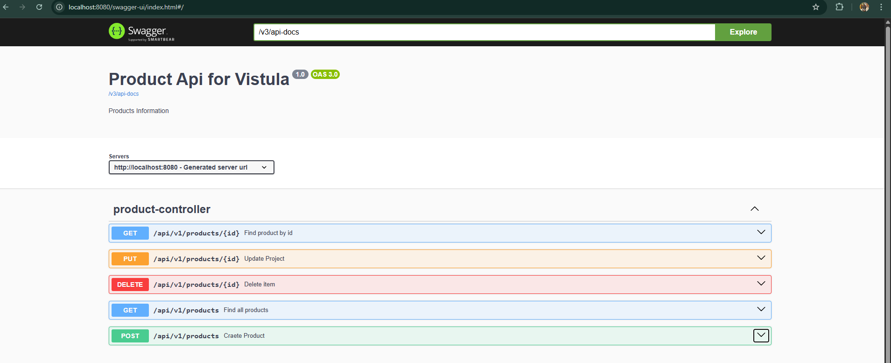
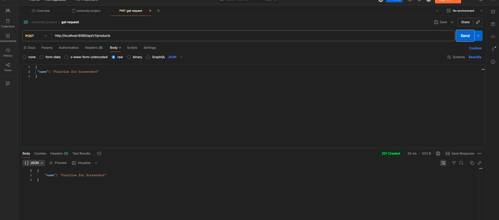
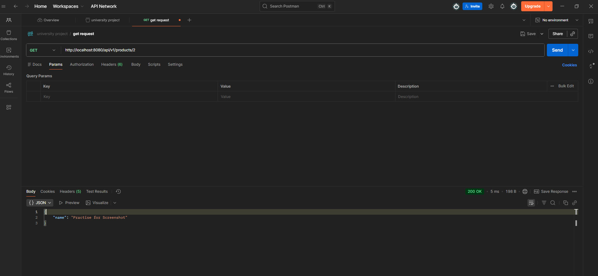
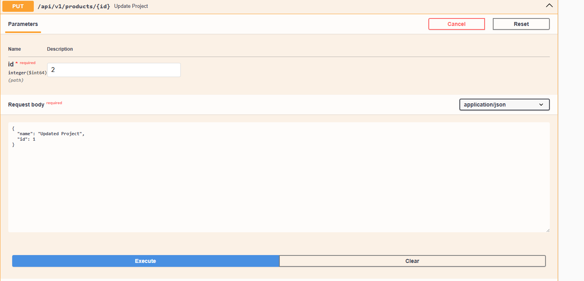
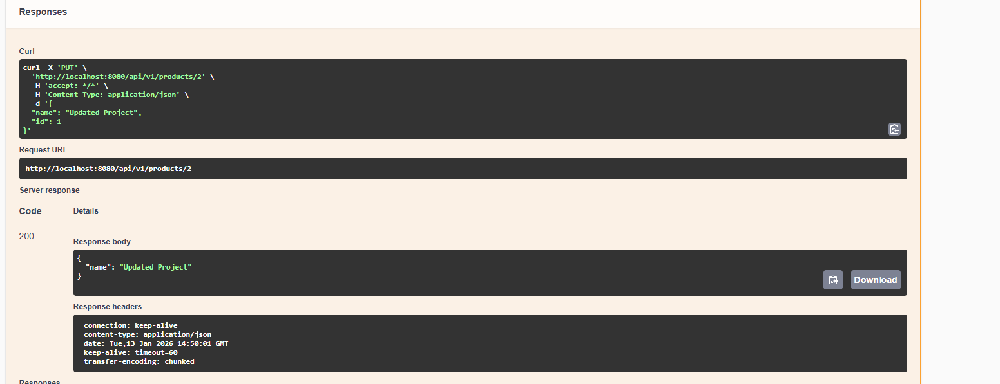
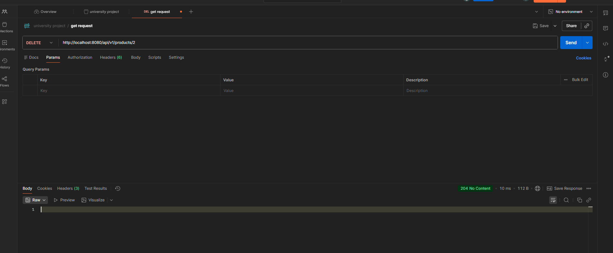
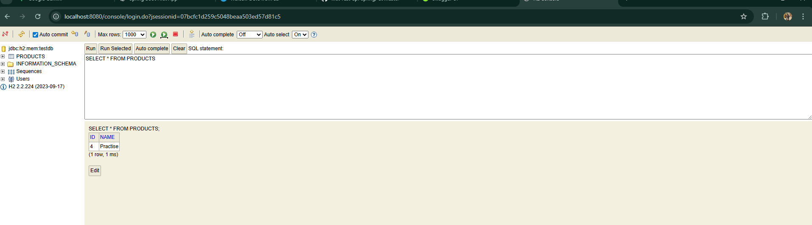

# Task 2: Spring Boot REST API

## Project Overview
This project is a **dedicated REST API** (backend only) for managing a product catalog.  
It demonstrates a **professional project structure**, evolving from an in-memory `HashMap` to a persistent **H2 Database** using **Spring Data JPA**.  

The project showcases:
- RESTful endpoint design
- CRUD operations
- Exception handling
- Database integration with H2
- API documentation with Swagger UI

---

## 1. Project Setup & API Documentation
- Initialized project with dependencies:
  - Spring Web
  - H2 Database
  - Spring Data JPA
  - Lombok
- Integrated **Swagger UI** to visualize and test endpoints

**Swagger UI URL:** [http://localhost:8080/swagger-ui/index.html](http://localhost:8080/swagger-ui/index.html)  

---

## 2. Use Cases & HTTP Methods

### A. Creating a Product (POST)
- Endpoint: `/api/v1/products`
- Send a **POST request** with a JSON body
- Response: **201 Created**

### B. Retrieving Products (GET)
- **Get All Products:** Returns a list of all products (200 OK)  
- **Get Product by ID:** Returns a specific product by its ID  
---

#### Get All Products 

---
#### Get A Specific Product by ID

### C. Updating a Product (PUT) 
- Endpoint: `/api/v1/products/{id}`
- Modify existing product details via PUT request
- Custom exception if product not found

### D. Deleting a Product (DELETE)
- Endpoint: `/api/v1/products/{id}`
- Deletes a product by ID
- Response: **204 No Content**

---

## 3. Database Management (H2 Console)
- Uses **H2 In-Memory Database**
- Configured `application.properties` for web console access
- Real-time verification of data

**H2 Console URL:** [http://localhost:8080/console](http://localhost:8080/console)  
**JDBC URL:** `jdbc:h2:mem:testdb`

---

## 4. Technical Implementation

- **Stereotypes:**
  - `@RestController` for API endpoints
  - `@Service` for business logic
  - `@Repository` for data access
- **Mapping:**
  - Used `ProductMapper` to convert between DTOs and Entities
- **Exception Handling:**
  - Implemented `@ControllerAdvice` to return clean error messages when a product is not found
